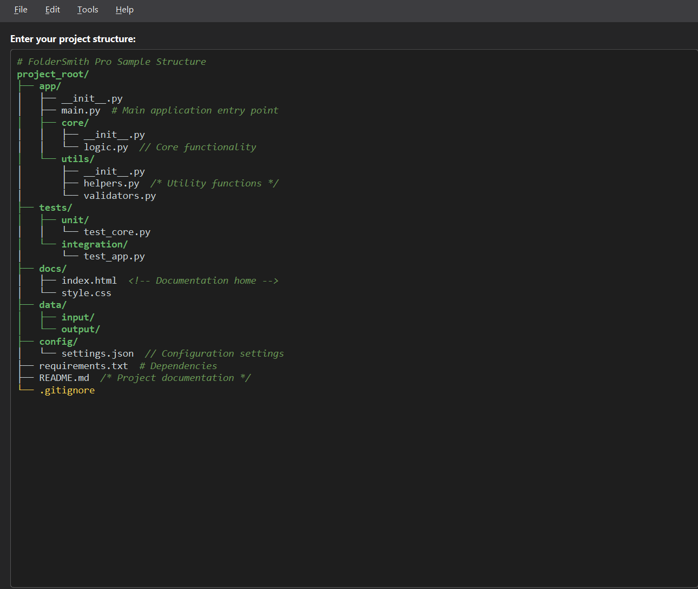
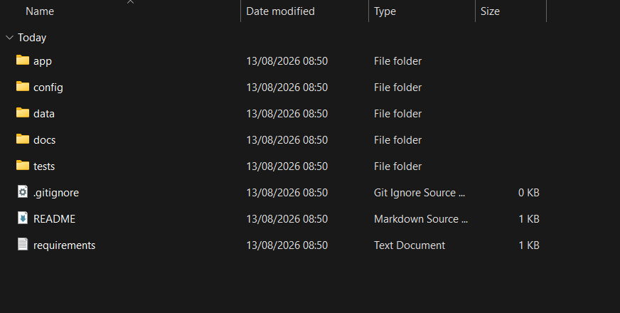
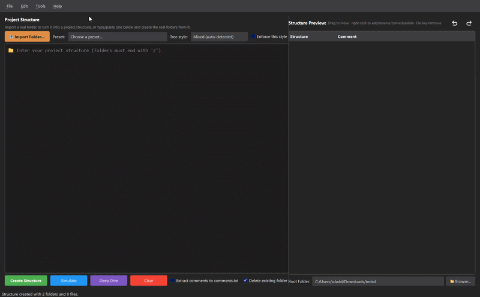

# FolderSmith Pro

Make a full app layout in one go. No need to click New Folder many times. Just type or paste a list, or a tree chart, and see it live. Then build it on disk, or save it as a ZIP.



## What It Does

- Paste text. Get folder and file items in one click.
- Reads tree charts too (the marks: `├──` `│` `└──`). No extra work from you.
- Pulls end notes from lines (`#` `//` `/* */` `<!-- -->` `--` `;` `%`) so they do not end up in names.
- Live view that shows just what you will get.
- Deep Dive view: a full list you can search, of every folder and file, before you build.
- Checks on disk after it is done, so you know it all went well.
- Save as ZIP, if you do not want to write to disk.
- Color marks by file kind.

## New Stuff

- **Style auto-pick.** Tree, plain text, or mixed - it picks the right one as you type. Tick "Enforce this style" to lock it. It will not swap style on its own then.
- **Mixed text read.** Tree marks plus plain space, read the best it can. Lines with no marks and no space stay flat, since there is no way to know depth for sure.
- **Live view acts like a file view.** Drag an item to move it. Right click to add a new folder or file, to rename, to swap folder and file, or to del it.
  - When you swap a folder into a file, it asks for a suffix (like `txt` or `py`). Close the box to skip it.
  - When you swap a file into a folder, it asks if you want to drop the old suffix.
- **No-limit undo and redo.** It works for typed text and for view edits, both, as one.
- **Multi cursor text box**, much like in VS Code. See Keys below.

## Needs

- Python 3.9+
- [PyQt6](https://pypi.org/project/PyQt6/)

```bash
pip install PyQt6
```

## Usage

```bash
python foldersmith.py
```

1. Paste your layout into the box (see form below).
2. Check the live view on the right. It shows just what will be made.
3. If you wish, open Tools, then Deep Dive, for a full list first.
4. Click Create Structure to build it, or use Export as ZIP.

## Layout Format

| Part | Syntax | Sample |
|---|---|---|
| Folder | Ends with `/` | `src/` |
| File | No end slash | `main.py` |
| Depth | Indent with spaces | `  utils/` |
| Notes | `#` `//` `/* */` `<!-- -->` `--` `;` `%` | `main.py  # entry point` |

Tree charts, pasted from `tree` or like tools, also work. They get read and fixed at once.

### Sample layout

```
my-app/
├── app/
│   ├── main.py             # Entry point of the app
│   ├── utils/
│   │   └── helpers.py
│   └── config.py
├── tests/
│   ├── test_main.py
│   └── test_helpers.py
├── assets/
│   └── logo.png
├── .gitignore
├── requirements.txt
└── README.md
```

Paste that block (or your own) into FolderSmith Pro and it will build the folder and file items for you.

## Keys

| Keys | What It Does |
|---|---|
| Ctrl+Z | Undo - text or view edits, both |
| Ctrl+Y | Redo |
| Alt+Click | Add an extra cursor. Click it again to del it |
| Alt+Shift+Click | Add a line of cursor spots, from here to the click spot |
| Esc | Clear all extra cursor spots |
| Alt+Up | Move this line up one spot |
| Alt+Down | Move this line down one spot |
| Alt+Shift+Up | Copy this line, put the copy up |
| Alt+Shift+Down | Copy this line, put the copy down |
| Home | Press once: go to first mark on line. Press again: go to spot zero |
| Ctrl+I | Import Folder (bring in a real folder) |
| Ctrl+Shift+C | Clear all text |

Note: cursor spots do not make a block pick, just many type spots.

## Output



## Demo



## Help

- Email: [studiocoding09@gmail.com](mailto:studiocoding09@gmail.com)
- Support: (https://chibuikeonuigbo.github.io/Support_Page/)

## Rights

(c) 2025 FolderSmith Pro. All rights kept.
